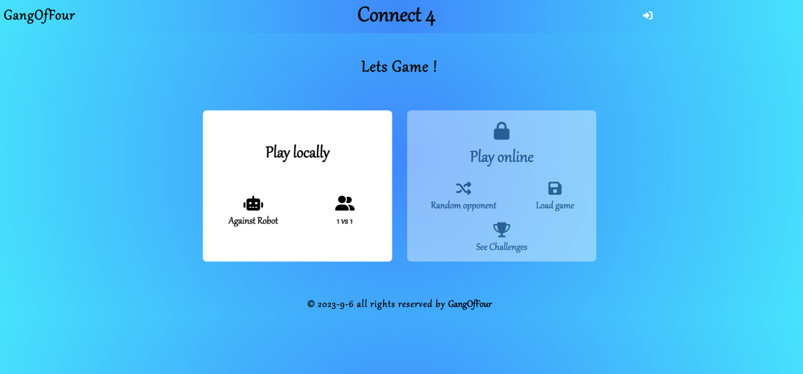
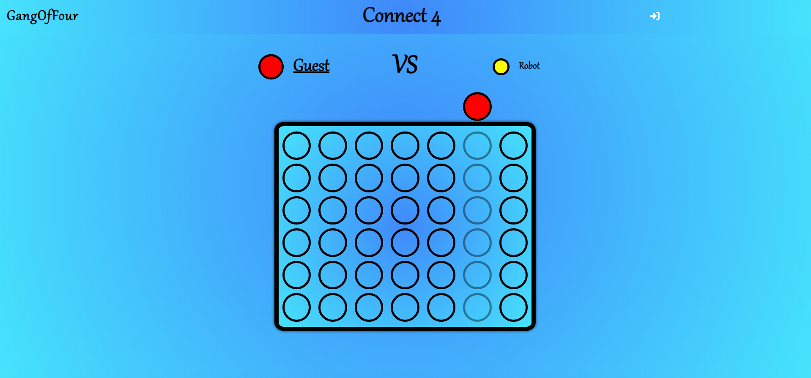
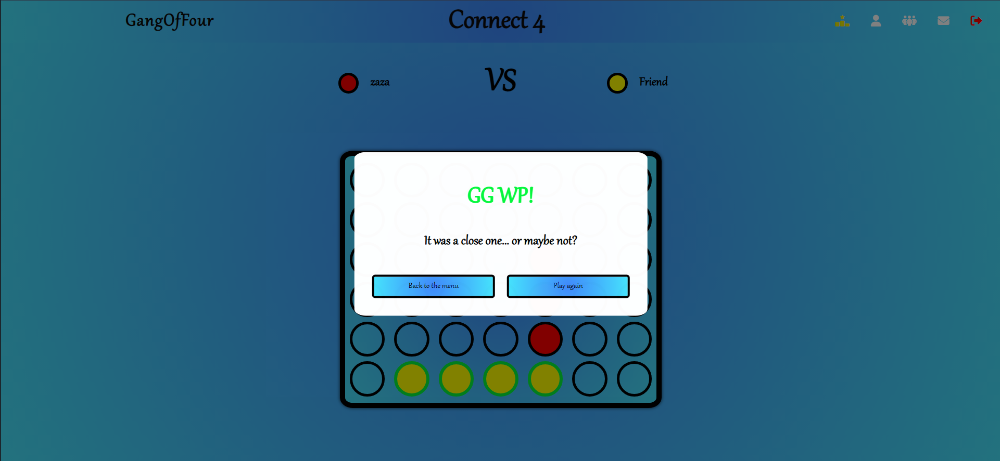
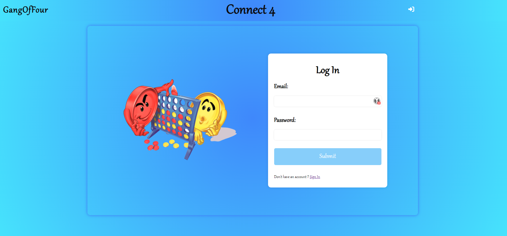
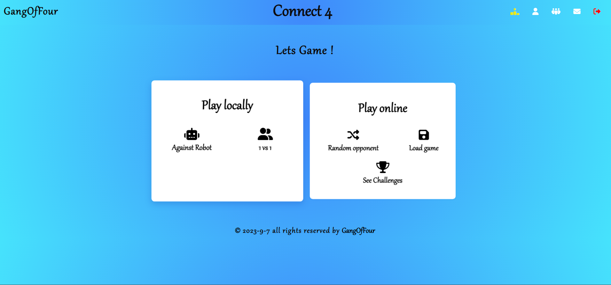
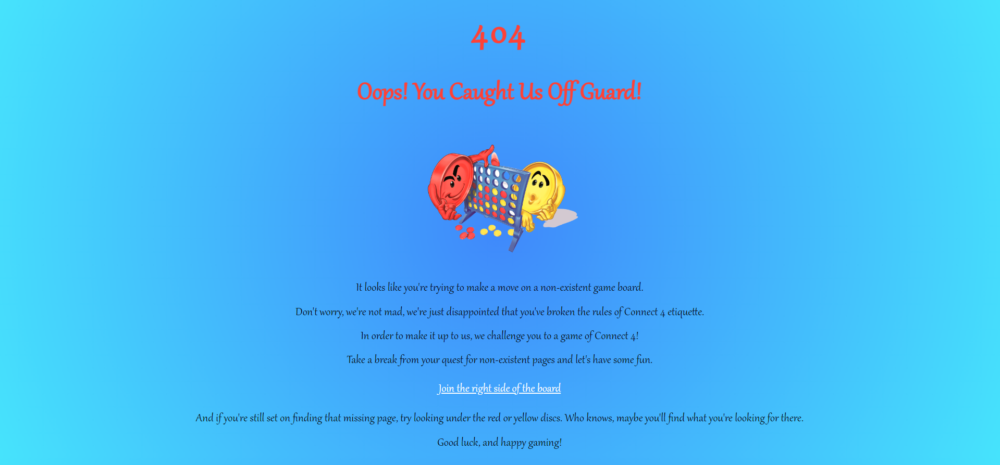

# Full stack connect4 game

## Overview

## Architecture

The code of this repo is split in 2 folders:
* back/ manages the server. It contains a server which differentiate REST requests from HTTP file requests, and so
return either files or REST responses accordingly.
* front/ contains static files that should be returned by the HTTP server mentioned earlier.

Both folders contain a README with more details.

## Requirements to run the project

* [Node.js](https://nodejs.org/) should be installed.
* Docker should be installed.
* The repo should have been cloned.

---

## All runs

Run "docker-compose build" and "docker-compose up" in a terminal and open "http://localhost:8000/" in a browser.

---

## Features

- Sign Up and Login
- Update your information
- Play in local
- Play against a bot, 2 levels are available
- Save a game to continue your game later
- Play a game against a random opponent and try to distract them with the in-game chat
- Add friends to play and chat with them
- Check your level with the ranking et statistics system
- Try to win challenges against the bot to win some trophies on your profile
